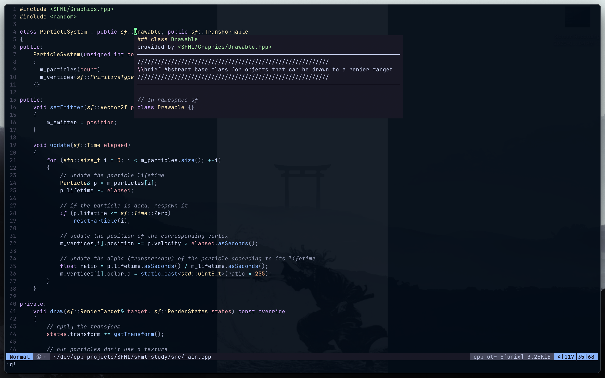
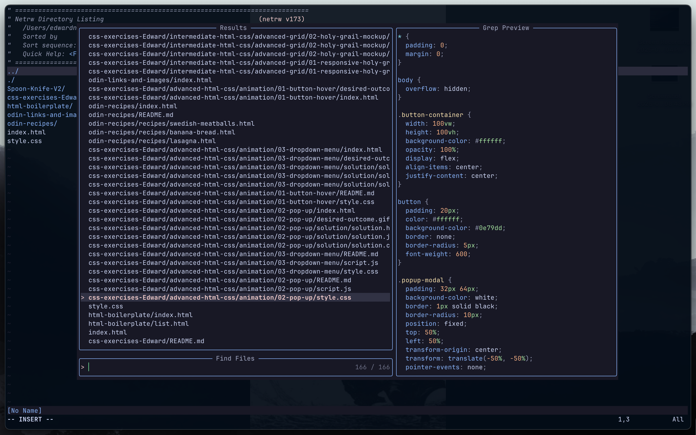

<div align=center> 
  
 # Neovim-dotfile 
 
</div>

<p align=center> A minimalist neovim set up designed for C/C++ development and web development. Feel free to make any suggestions :smile: </p>

<div align=center> 
   
</div>

# :sparkles: Features

* __Plugin Manager__ : [LazyVim](https://github.com/LazyVim/LazyVim)

* __Treesitter__ : [nvim-treesitter](https://github.com/nvim-treesitter/nvim-treesitter)



  * Installed Languages: C, C++, CSS, Lua, Vim, Vimdoc, Query, Elixer, Heex, Javascript, HTML

* __Language Server Protocol__ : [nvim-lspconfig](https://github.com/neovim/nvim-lspconfig)

  * Lua Language Server
  * Clangd
  * Typescript Language Server

* __Fuzzy Finder__ : [telescope.nvim](https://github.com/nvim-telescope/telescope.nvim) 



* __Other__ : Auto indentation, auto pairing, status line, cattuppucin colorscheme


# :zap: Dependencies
>[!NOTE]
>You will have to manually install language server protocols on your own platform, this is because [nvim-lspconfig](https://github.com/neovim/nvim-lspconfig) only tells Neovim how to connect to LSPs.
* Lua Language Server
  <details>
  <summary> Installation </summary>
    <p> 
    
    <b>Windows</b> : `scoop install lua-language-server`
  
    <b>macOS</b> : `brew install lua-language-server`
  
    <b>Linux/Other</b> : [Official Website](https://luals.github.io/#neovim-install)
  
    </p>
  </details>

* Clangd
  <details>
    <summary> Installation </summary>
     <p>

   <b>Windows</b> : [Windows Download](https://releases.llvm.org/download.html)

  <b>macOS</b> : `brew install llvm`

   <b>Debian/Ubuntu</b> :
  ```
  sudo apt-get install clangd-12
  sudo update-alternatives --install /usr/bin/clangd clangd /usr/bin/clangd-12 100
  ```

  <b>Other</b> : [Official Website](https://clangd.llvm.org/installation)  
   </p>
    </details>
* Typescript Language Server
  <details>
    <summary> Installation </summary>

    <p>

    <b>Windows/Linux</b> : [Official Website](https://github.com/typescript-language-server/typescript-language-server)

    <b>macOS</b> `brew install typescript-language-server`

    </p>
  
  </details>
# :rocket: Installation
```
git clone git@github.com:EdwardVNguyen/nvim-dotfiles.git
```
